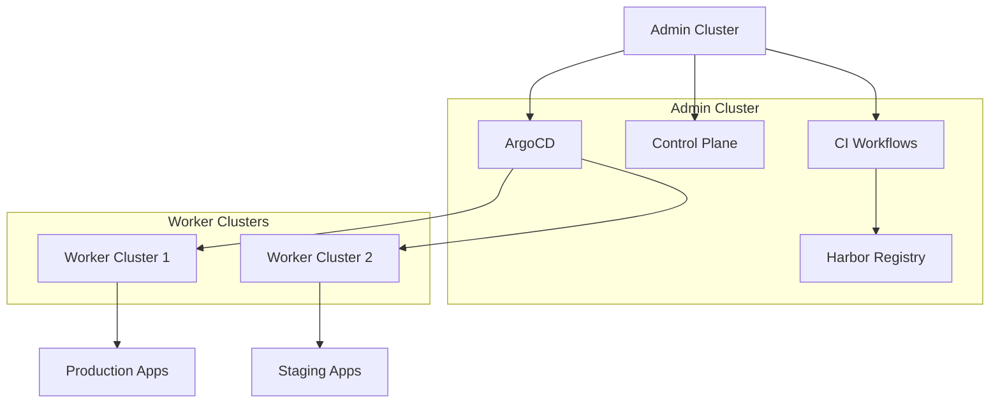

# Multi-Cluster Architecture v2: Admin Cluster vs Worker Cluster

## 1. Architecture Overview

The new architecture separates concerns by introducing dedicated admin clusters for control plane operations and worker clusters for application workloads. This separation provides cleaner resource management, enhanced security, and simplified operations.

### 1.1 Centralized Platform Infra Repo Pattern

This architecture implements a centralized infrastructure repository pattern where platform-level infrastructure configurations are managed separately from application-specific deployments:

- **luban-infra-ci**: Central repository for CI infrastructure configurations (service accounts, RBAC, secrets)
- **luban-infra-cd**: Central repository for CD infrastructure configurations (ArgoCD applications, cluster configs)
- **User App GitOps Repos**: Separate repositories containing only application manifests per project

This pattern ensures platform consistency, simplifies credential management, and reduces operational overhead by avoiding per-project infrastructure repository proliferation.



## 2. Cluster Roles and Responsibilities

### 2.1 Admin Cluster (Control Plane)
- **Purpose**: Hosts all CI/CD infrastructure and control plane components
- **Key Components**:
  - Luban CI (argo workflows)
  - ArgoCD for GitOps deployments
  - Harbor image registry
  - Monitoring and logging infrastructure
- **Namespace Strategy**:
  - `luban-ci`: Core CI infrastructure components
  - `ci-{project_name}`: Project-specific CI workflows

### 2.2 Worker Clusters (Runtime)
- **Purpose**: Hosts user applications and workloads
- **Key Components**:
  - Application deployments (Dagster, code locations, etc.)
  - Environment-specific configurations
- **Namespace Strategy**:
  - `snd-{project_name}`: Staging environment
  - `prd-{project_name}`: Production environment

## 3. Namespace Architecture

### 3.1 Namespace Types and Purposes

| Namespace Pattern | Cluster Type | Purpose | Environment Specific | GitOps Repo |
|-------------------|--------------|---------|---------------------|-------------|
| `luban-ci` | Admin | Core CI infrastructure | No | luban-infra-ci |
| `ci-{project_name}` | Admin | Project CI workflows | No | luban-infra-ci |
| `snd-{project_name}` | Worker | Staging applications | Yes | User App GitOps |
| `prd-{project_name}` | Worker | Production applications | Yes | User App GitOps |

### 3.2 Centralized Infrastructure Repository Structure

**luban-infra-ci Repository**:
- Service accounts and RBAC configurations
- CI pipeline templates and shared workflows
- Registry credentials and image pull secrets
- Cross-project infrastructure components
- Platform-level secrets and configurations

**luban-infra-cd Repository**:
- ArgoCD application definitions for infrastructure
- Cluster configuration and management manifests
- Platform-wide deployment patterns
- Environment provisioning templates

**User App GitOps Repositories**:
- Application-specific deployment manifests
- Environment-specific configurations (snd/prd)
- Application-level secrets and configmaps
- Service definitions and ingress rules

### 3.2 Single Cluster Deployment
For single cluster scenarios, all namespaces coexist in the same cluster:
- `ci-{project_name}` (CI workflows)
- `snd-{project_name}` (staging apps)
- `prd-{project_name}` (production apps)

## 4. Secret and Credential Distribution

### 4.1 Centralized Secret Management
The centralized repository pattern simplifies secret management across the platform:

**Platform Admin Responsibilities**:
- Manage all infrastructure credentials in `luban-infra-ci` repository
- Update service accounts, RBAC, and registry credentials centrally
- Propagate changes to all `ci-{project_name}` namespaces via ArgoCD
- Maintain platform-wide secrets and configurations

**Worker Cluster Secret Requirements**:
- Only requires `image_pull_secret` for Harbor registry access
- No CI-related credentials or infrastructure manifests
- Environment-specific application configurations only
- Application-level secrets managed in user GitOps repos

> Important: Kubernetes secrets are cluster-local. The replicator controller can only copy secrets within the same cluster. In multi-cluster setups, ensure worker clusters receive required pull secrets via their own bootstrap process (e.g., `make secrets` on each cluster, ExternalSecrets, or a cluster bootstrap repo).

**Credential Update Flow**:
1. Platform Admin updates credentials in `luban-infra-ci` repository
2. ArgoCD detects changes and syncs to all admin cluster namespaces
3. Worker clusters receive updated pull secrets via their own bootstrap mechanism (cluster-local secrets)
4. No per-project repository updates required

### 4.2 Credential Flow
```
Harbor Registry ← Admin Cluster (ci-{project_name})
     ↓
Worker Clusters (image_pull_secret only)
```

## 5. CI/CD Workflow with Centralized Repos

### 5.1 Infrastructure Provisioning Flow
1. **luban-provisioner** creates new project and triggers namespace provisioning
2. Platform Admin updates `luban-infra-ci` with project-specific configurations
3. ArgoCD syncs infrastructure manifests to `ci-{project_name}` namespace
4. Service accounts, RBAC, and secrets automatically configured

### 5.2 Image Build Process
1. Code changes trigger CI workflow in `ci-{project_name}` namespace
2. Build process runs in admin cluster using shared infrastructure from `luban-infra-ci`
3. Built images pushed to Harbor registry using centralized credentials
4. Workflow status/logs accessible via Argo Workflows UI

### 5.3 Deployment Process
1. ArgoCD monitors **User App GitOps** repository for application changes
2. New image references detected in application manifests
3. ArgoCD deploys to appropriate worker cluster:
   - `snd-{project_name}` for staging (from user GitOps repo)
   - `prd-{project_name}` for production (from user GitOps repo)
4. Worker clusters pull images from Harbor using centralized `image_pull_secret`

### 5.4 Cluster Selection via `cluster_map`

ArgoCD destination clusters are selected by a simple mapping in `luban-config`:

- `cluster_map["snd"]` → destination server for Sandbox deployments
- `cluster_map["prd"]` → destination server for Production deployments

Provisioning templates use this map to set `spec.destination.server` when creating AppProjects and Applications.

## 6. Benefits of This Architecture

### 6.1 Resource Optimization
- CI workloads don't consume worker cluster resources
- Worker clusters focus solely on application performance
- Predictable resource allocation per cluster type

### 6.2 Operational Simplicity
- Reduced secret management overhead
- Clear separation of concerns
- Simplified namespace provisioning
- Lower day-2 operational complexity

### 6.3 Security Enhancement
- CI credentials isolated in admin cluster
- Minimal credential exposure to worker clusters
- Reduced attack surface on runtime environments

### 6.4 Scalability
- Independent scaling of CI infrastructure and application workloads
- Multiple worker clusters can share single admin cluster
- Easy addition of new environments without CI reconfiguration

## 7. Implementation Considerations

### 7.1 Namespace Provisioning
- `ci-{project_name}`: Provisioned in admin cluster, managed by `luban-infra-ci`
- `snd-{project_name}` and `prd-{project_name}`: Provisioned in worker clusters, managed by user GitOps repos
- **luban-provisioner** coordinates with Platform Admins for infrastructure setup
- Platform Admins manage centralized infrastructure repositories

### 7.2 Network Requirements
- Admin cluster must be accessible from worker clusters for image pulls
- ArgoCD needs connectivity to all target clusters
- Consider network policies for cross-cluster communication

### 7.3 Monitoring Strategy
- Separate monitoring stacks for admin and worker clusters
- CI workflow monitoring in admin cluster
- Application monitoring in worker clusters
- Centralized logging aggregation recommended

## 8. Benefits of Centralized Infrastructure Repos

### 8.1 Operational Efficiency
- **Single Source of Truth**: Platform configurations managed in centralized repos
- **Reduced Maintenance**: Update once in `luban-infra-ci/cd`, propagate to all projects
- **Consistent Security**: Standardized RBAC and credential management across platform
- **Simplified Auditing**: Infrastructure changes tracked in dedicated repositories

### 8.2 Scalability and Consistency
- **Platform-Wide Updates**: Credential rotations affect all projects simultaneously
- **Template-Based Approach**: Reusable infrastructure patterns in centralized repos
- **Reduced Repository Proliferation**: No need for per-project infrastructure repos
- **Admin-Controlled Changes**: Platform Admins manage critical infrastructure updates

### 8.3 Clear Separation of Concerns
- **Platform vs Application**: Infrastructure managed separately from application deployments
- **Admin vs Developer**: Platform Admins handle infrastructure, developers focus on applications
- **Centralized vs Distributed**: Core platform services centralized, applications distributed

## 9. Migration Path

Existing deployments can migrate to this centralized architecture by:

1. **Setup Centralized Infrastructure Repos**:
   - Create `luban-infra-ci` and `luban-infra-cd` repositories
   - Migrate shared infrastructure configurations from existing repos
   - Establish ArgoCD applications for infrastructure management

2. **Configure Admin Cluster**:
   - Set up `luban-ci` namespace with core platform services
   - Configure ArgoCD to manage infrastructure from centralized repos
   - Establish service accounts and RBAC in `luban-infra-ci`

3. **Migrate CI Workflows**:
   - Move CI workflows to admin cluster `ci-{project_name}` namespaces
   - Update workflows to use centralized infrastructure from `luban-infra-ci`
   - Clean up CI-related resources from worker clusters

4. **Restructure Application Repos**:
   - Separate application manifests into dedicated user GitOps repos
   - Remove infrastructure components from application repositories
   - Configure ArgoCD applications pointing to user repos for deployments

5. **Validate and Optimize**:
   - Test credential propagation from centralized repos
   - Verify ArgoCD synchronization across all clusters
   - Monitor and optimize the new architecture
